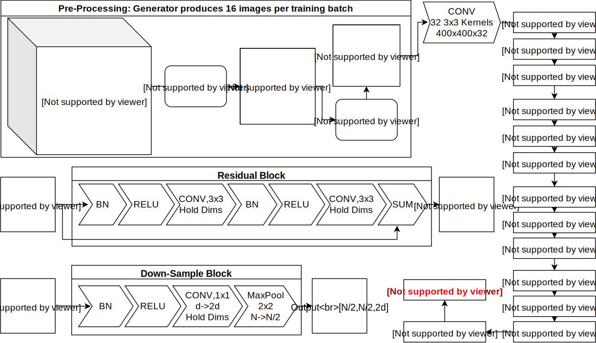

#RSNA Pneumonia Detection Challenge

Below is a write for the Kaggle competition, RSNA Pneumonia Detection Challenge.  The goal of this write up is to serve as a tutorial for how the kernel can be implemented to predict if DICOM images of patient’s chest indicate pneumonia.  Furthermore, justifications for how the model was specified are provided below.

#Importing the Kernel and Data

To import the Kernel into google colab, use the link: https://github.com/chonorat/Pneumonia

The first procedure in the kernel automatically imports and unzips the train images, test images, train labels, and class info documents from the Kaggle competition page.

#Data Visualizations

After merging the training labels and class info from the csv’s provided, the kernel extracts patient information from the DICOM images such as Age and Sex.

The kernel then plots the rate of pneumonia between males and females and an age histogram of patients with pneumonia and not with pneumonia.  No discernable differences were present in either of these comparisons.

The images are then cropped in order to improve efficiency and accuracy of the neural network.  A sample image is then displayed which shows the original image and bounding boxes along with the new cropped image and bounding boxes.

#Pneumonia Dictionary

Creates a dictionary of all pneumonia locations and adjusts the bounding box coordinates to reflect the image cropping.

#Data Generator Class

The Data Generator feeds formatted data to the network for training.  The generator samples batches of size 16, crops the images, resizes the images, and creates a mask for the image.  Masks for images with pneumonia have the value 1 on the area of the bounding box and the value 0 everywhere else.  Masks without a bounding box consist entirely of 0.

#Neural Network

The CNN design is based on the Residual Network principle. In this simple application of a ResNet, there are 9 residual blocks each containing 2 convolution layers, 3 Pooling blocks each with 1 convolution layer, and an initializing convolution, giving this network a total depth of 22. This design included a downsample (MaxPool) every 3rd redidual block. This network is optimized for for an input image of size 200x200.

#Loss Function

Intersection over union is a measure of how accurately a bounding box represents its target. Intersection is the part of the estimated box that is correct. Union is the portion of the estimated box outside the correct region. The goal of an IoU loss function is to maximize this value such that the estimated bounding box contains the correct region while aiming to restrict the box tightly to the target.

#Predictions

After the model trains, the kernel outputs predictions for the validation set along with predicted bounding boxes in blue and actual bounding boxes in red for the fist batch.

Finally, the model is called to make predictions for the 3000 test images.  These predictions are saved to a CSV in the folder ‘/content/predictions.csv’.
